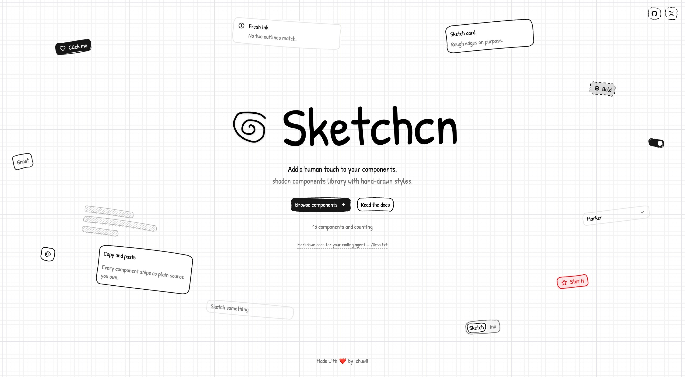

# Sketchcn

Add a human touch to your components.

A ui registry of hand-drawn components for React made with RoughJS and shadcn/ui.

[sketchcn.chuwii.com](https://sketchcn.chuwii.com)



## Install

```bash
bunx shadcn@latest add https://sketchcn.chuwii.com/r/button.json
```

## Collaborating

Contributions are welcome — new components, fixes, or ideas. Everything happens in this repo.

1. Branch off `main` (`feat/tooltip`, `fix/card-stroke`).
2. Add the source in `registry/` and declare it in `registry.json`, keeping shadcn names (`button.tsx`, not `sketch-button.tsx`).
3. Run `bun run check` and `bun run build:registry`.
4. Open a PR with a conventional commit title and a screenshot for visual changes.

Not sure where to start? Open an issue.

## Say hi

- X — [@chuchuwiiii](https://x.com/chuchuwiiii)
- GitHub — [@chuwong35122](https://github.com/chuwong35122)
- Web — [chuwii.com](https://chuwii.com)

---

Licensed under the [MIT license](https://opensource.org/license/mit).
